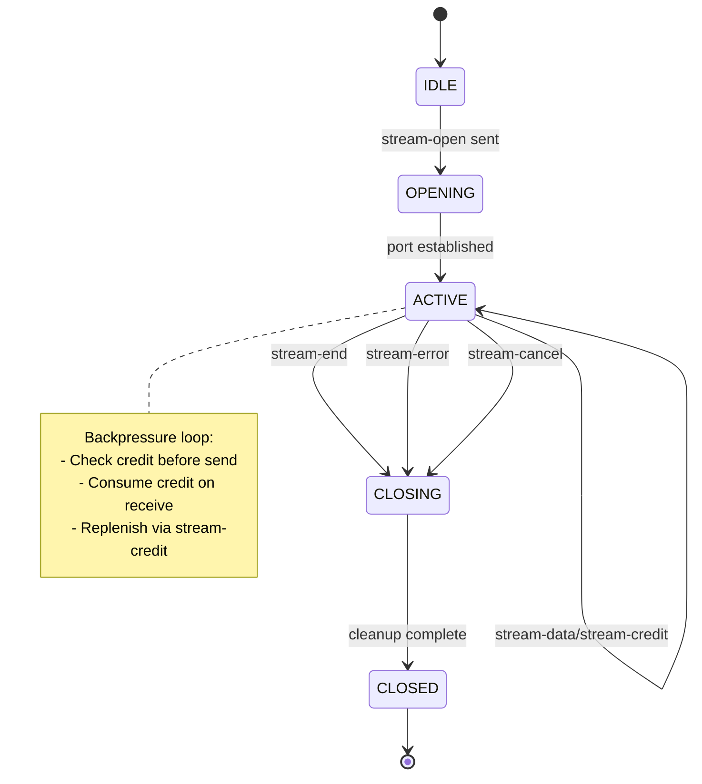
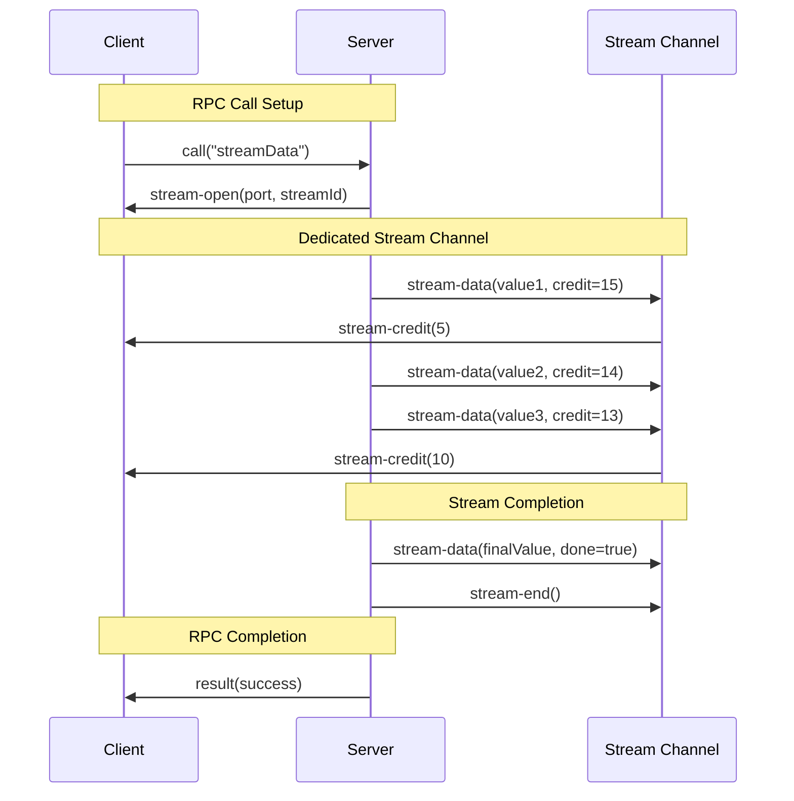
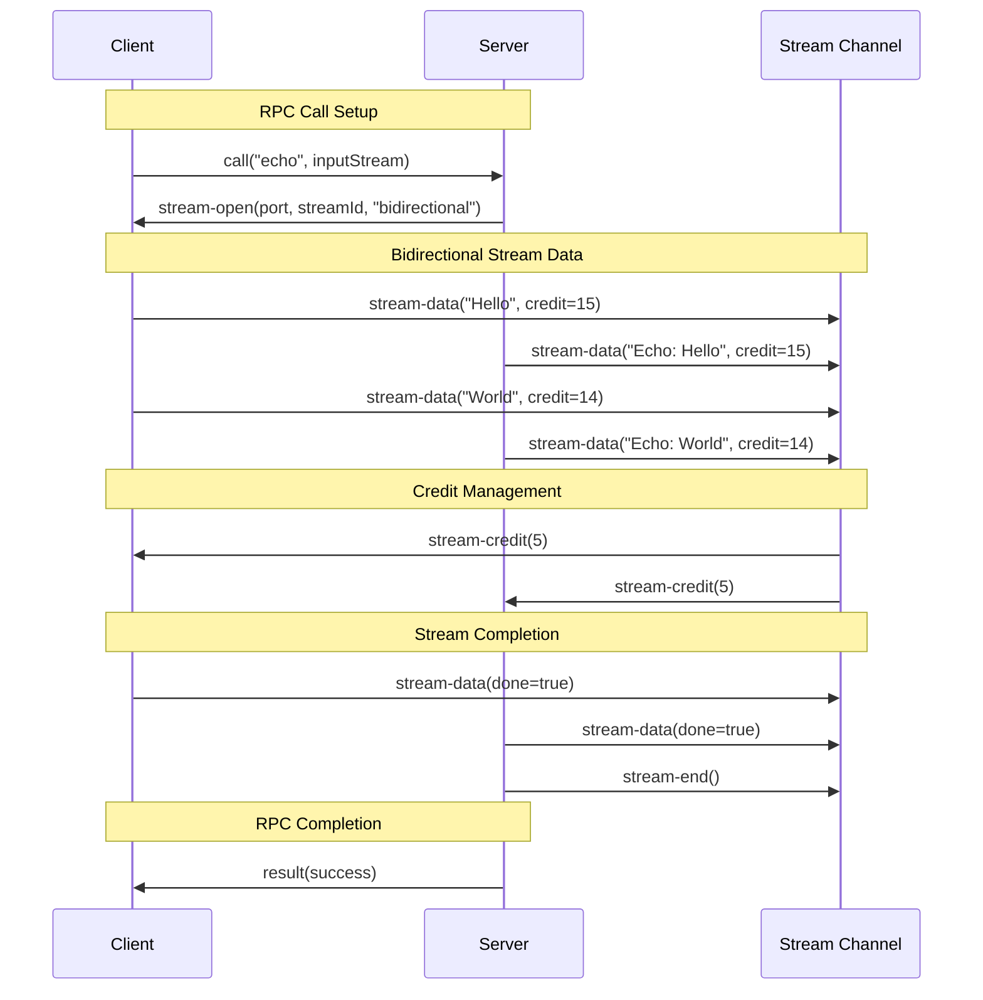
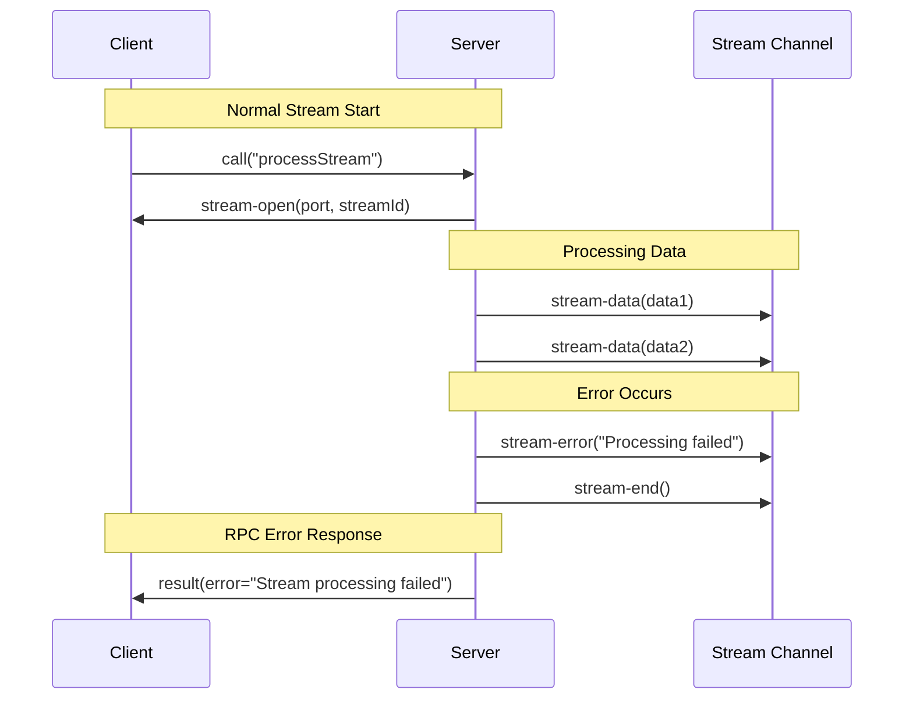
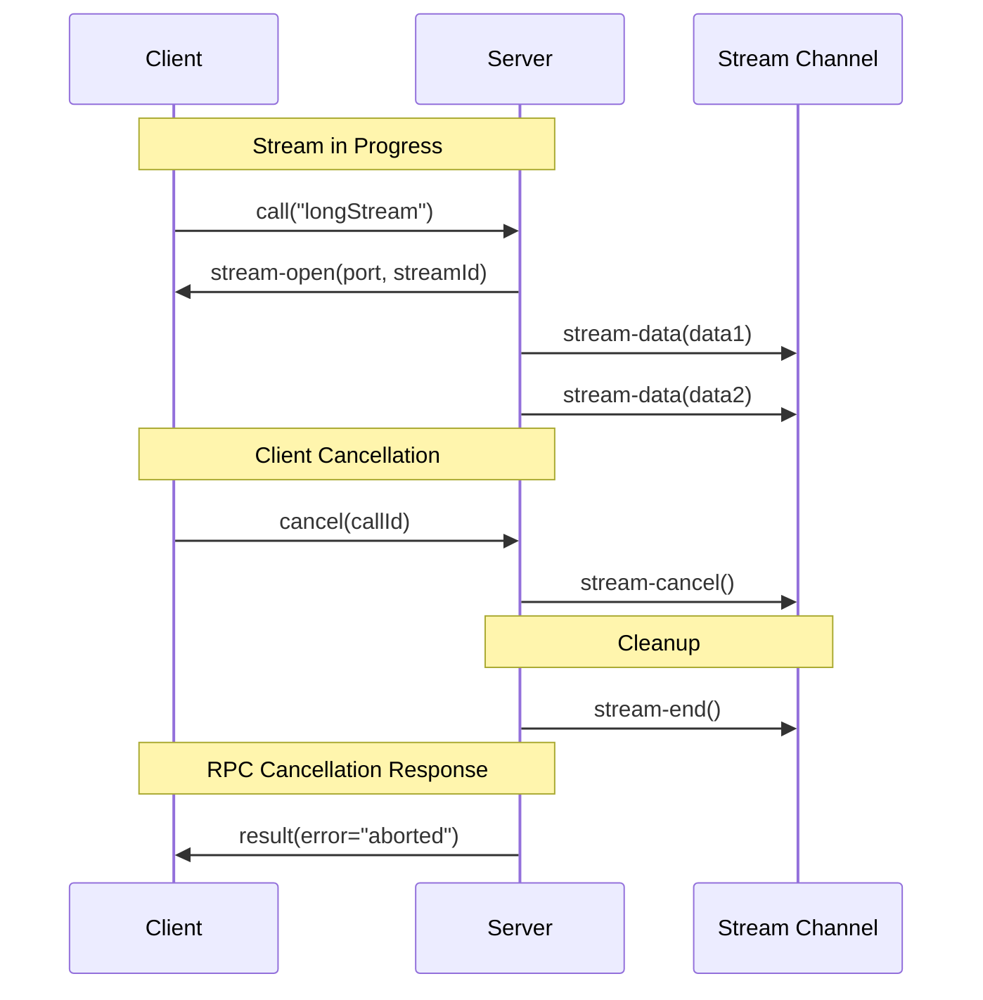
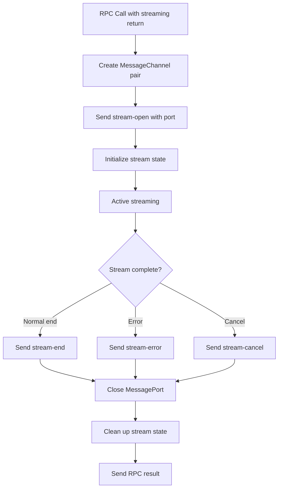
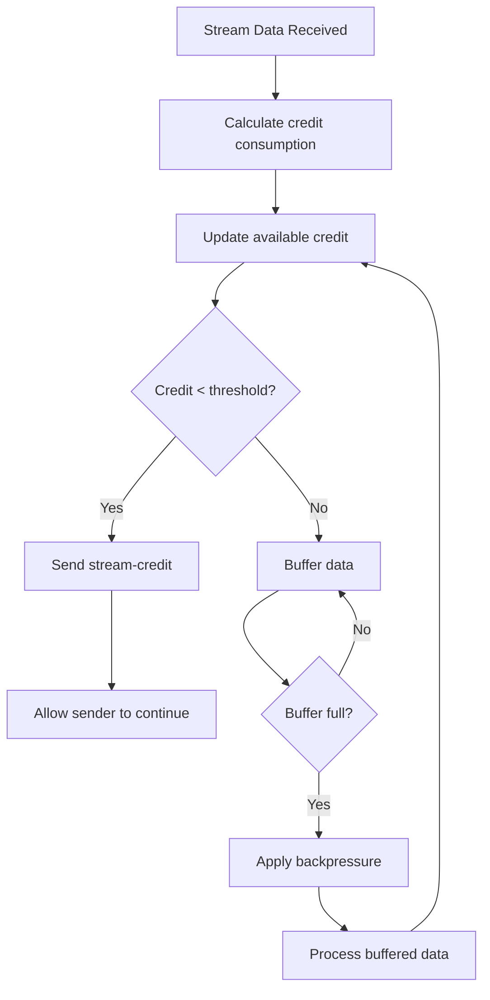
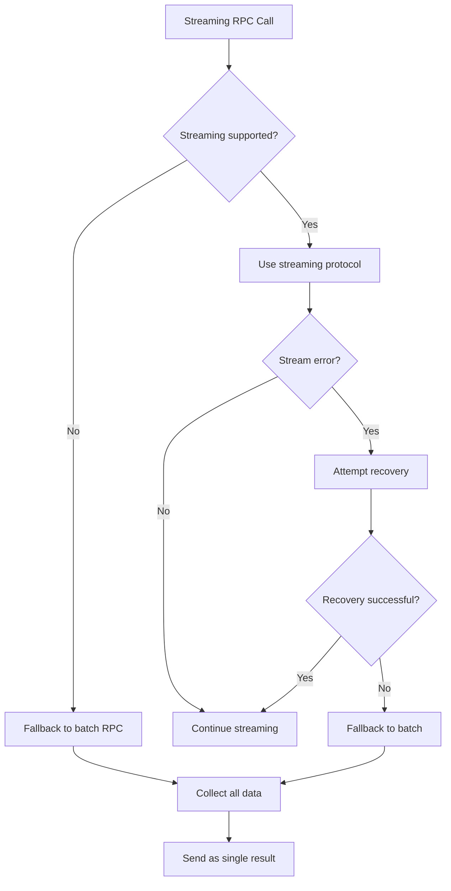

# Phase 2 Streaming Protocol Diagrams

## Stream State Machine



## Sequence Diagrams

### Unidirectional Streaming (Server → Client)



### Bidirectional Streaming



### Error Handling in Streams



### Cancellation Flow



## Backpressure Flow Control

### Credit Management Flow

```mermaid
flowchart TD
    A[Sender wants to send data] --> B{Credit >= sizeFunction(data)?}
    B -->|Yes| C[Send stream-data]
    B -->|No| D[Wait for stream-credit]
    
    C --> E[Receiver processes data]
    E --> F[Update available credit]
    F --> G{Credit < highWaterMark / 2?}
    G -->|Yes| H[Send stream-credit]
    G -->|No| I[Continue processing]
    
    D --> J[Receive stream-credit]
    J --> K[Update sender credit]
    K --> B
    
    H --> L[Sender receives credit]
    L --> K
```

### Size Function Strategies

```mermaid
flowchart LR
    A[Data Item] --> B{Size Strategy}
    B -->|"items"| C[Credit = 1]
    B -->|"bytes"| D[Credit = byteLength]
    B -->|Custom Function| E[Credit = fn(data)]
    
    C --> F[Simple counting]
    D --> G[Memory-based]
    E --> H[Domain-specific]
```

## Resource Management

### Stream Lifecycle Management



### Memory Management



## Error Recovery Patterns

### Graceful Degradation



These diagrams provide visual representation of the streaming protocol behavior,
state transitions, and flow control mechanisms specified in the Phase 2 design.
